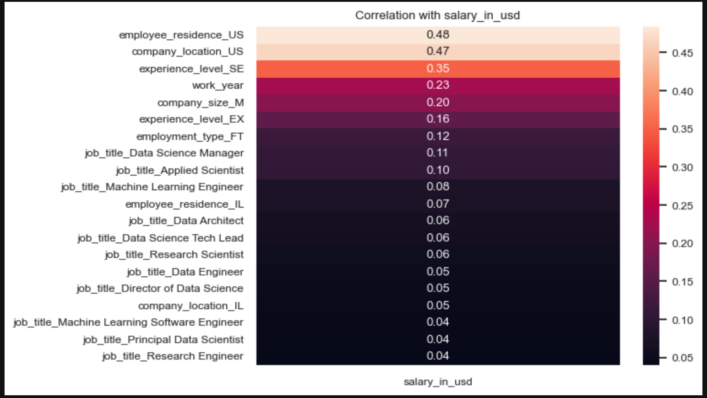

<h1 align="center">Predicting Data Science Salaries</h1>

## Table of Contents ##

- [Description](#description)
- [Background](#background)
- [Dataset Features](#dataset_features)
- [Installation Requirements](#installation-requirements)
- [Approach](#approach)
- [Evaluation](#evaluation)
- [Images](#images)
- [Contributors](#contributors)
- [Sources](#sources)
- [License](#license)

## Description ##
This project focuses on developing a machine learning model for predicting salaries. The objective is to develop a machine learning model that  estimates salaries based on various key features. For data cleaning, features were evaluated for importance and predictive value. Supervised learning and neural network models were developed and tested to deliver reliable predictions.

<a href="" target="_blank" rel="noreferrer"></a>
<a href="" target="_blank" rel="noreferrer"></a>

## Background ##
Data science is a field that combines various techniques, algorithms, and tools to extract meaningful insights and knowledge from structured and unstructured data. Data science salaries can vary widely depending on several factors such as location, level of experience, industry, company size, and education. The rapid growth of the data science field has resulted in an increased demand for accurate salary predictions within the industry.

## Dataset Features ##
This section provides a description of the features included in the dataset.
```
work_year: The year the salary was paid.
experience_level: The experience level in the job during the year
employment_type: The type of employment for the role
job_title: The role worked in during the year.
salary: The total gross salary amount paid.
salary_currency: The currency of the salary paid as an ISO 4217 currency code.
salary_in_usd: The salary in USD
employee_residence: Employee's primary country of residence in during the work year as an ISO 3166 country code.
remote_ratio: The overall amount of work done remotely
company_location: The country of the employer's main office or contracting branch
company_size: The median number of people that worked for the company during the year
```

## Installation Requirements ##
Import the following packages before running the script. For the prediction user interface:
```
import pandas as pd
from pathlib import Path
import seaborn as sn
import numpy as np
import pickle
import streamlit as st
import matplotlib.pyplot as plt
```
For supervised learning models and evaluation:
```
from sklearn.model_selection import train_test_split
from sklearn.preprocessing import StandardScaler
from sklearn.impute import SimpleImputer
from sklearn.pipeline import Pipeline
from sklearn.compose import ColumnTransformer
from sklearn.metrics import mean_squared_error, mean_absolute_error, r2_score
from sklearn.linear_model import LinearRegression,Ridge,Lasso
from sklearn.tree import DecisionTreeRegressor
from sklearn.ensemble import RandomForestRegressor, GradientBoostingRegressor
from sklearn.svm import SVR
from sklearn.neighbors import KNeighborsRegressor
from sklearn.cluster import KMeans
from sklearn.decomposition import PCA
from sklearn.feature_selection import SelectKBest, f_regression
from sklearn.model_selection import GridSearchCV, cross_val_score
from sklearn import metrics
from sklearn.preprocessing import MinMaxScaler,StandardScaler
from sklearn.feature_selection import RFE
from sklearn.gaussian_process import GaussianProcessRegressor
```
For neural network model creation and evaluation:
```
import warnings
from sklearn.preprocessing import StandardScaler,OneHotEncoder
from sklearn.model_selection import train_test_split
from tensorflow.keras.layers import Dense
from tensorflow.keras.models import Sequential
from sklearn.linear_model import LinearRegression
from sklearn.metrics import mean_squared_error
from sklearn.metrics import classification_report
warnings.filterwarnings('ignore')
```
## Approach ##
Preprocessing of the data involves analysis of the features and the target variable (salary_in_usd). Scikit-learn fitted attribute `feature_importances_` is used for analysis. Correlation of features to the target variable was also used using the Pandas attribute `pandas.DataFrame.corr(method='pearson')`.

**Feature Importance**

Feature importance is a measure of the relative importance or relevance of each feature to the model's prediction. Importance in the chart below quantifies how much each feature contributes to the model's overall performance in making accurate predictions. We used this information to identify influential features, and gain further insights into the model's behavior.

<a href="" target="_blank" rel="noreferrer"></a>

**Correlation to the Target Variable**

We used this metric to assess the relationship between each individual feature and the target variable (salary_in_usd). A positive correlation means that as the feature increases, the target variable tends to increase, while negative correlation means that as the feature increases, the target variable tends to decrease. Correlation to the target variable was also analyzed to assess the feature's behavior.

<a href="" target="_blank" rel="noreferrer"></a>

## Evaluation ##
### Model Evaluation ###
** Supervised Learning Models **
A regression model was used for this project. Mean Absolute Error (MAE), Mean Squared Error (MSE), and Root Mean Square Error (RMSE) are commonly used metrics for evaluating regression models. The supervised learning models in this project were evaluated based on MAE since it less sensitive to salary outliers.


Neural Network Models

## Contributors ##
+ Philippe Timothe (PhilippeTimothe@gmail.com)
+ Bryan Lu (btl245@stern.nyu.edu)
+ Vadim Yermak (vadik.ermak@gmail.com)
+ John Nguyen (nguyenjohn1337@gmail.com)
+ Cherryl Adzang (cherryl.adzang@gmail.com)

## Sources ##
Columbia Engineering Bootcamp learning materials

[RANDOMARNAB]. [2023].[Data Science Salaries 2023 : Salaries of Different Data Science Fields in the Data Science Domain]. Retrieved [2023-06-23] from [https://www.kaggle.com/datasets/arnabchaki/data-science-salaries-2023].

## License ##

    MIT License

    Copyright (c) 2023 Columbia University - CU-VIRT-FIN-PT-03-2023-U-B-TTH - Team 3

    Permission is hereby granted, free of charge, to any person obtaining a copy of this software and associated documentation files (the "Software"), to deal in the Software without restriction, including without limitation the rights to use, copy, modify, merge, publish, distribute, sublicense, and/or sell copies of the Software, and to permit persons to whom the Software is furnished to do so, subject to the following conditions:

    The above copyright notice and this permission notice shall be included in all copies or substantial portions of the Software.

    THE SOFTWARE IS PROVIDED "AS IS", WITHOUT WARRANTY OF ANY KIND, EXPRESS OR IMPLIED, INCLUDING BUT NOT LIMITED TO THE WARRANTIES OF MERCHANTABILITY, FITNESS FOR A PARTICULAR PURPOSE AND NONINFRINGEMENT. IN NO EVENT SHALL THE AUTHORS OR COPYRIGHT HOLDERS BE LIABLE FOR ANY CLAIM, DAMAGES OR OTHER LIABILITY, WHETHER IN AN ACTION OF CONTRACT, TORT OR OTHERWISE, ARISING FROM, OUT OF OR IN CONNECTION WITH THE SOFTWARE OR THE USE OR OTHER DEALINGS IN THE SOFTWARE.
